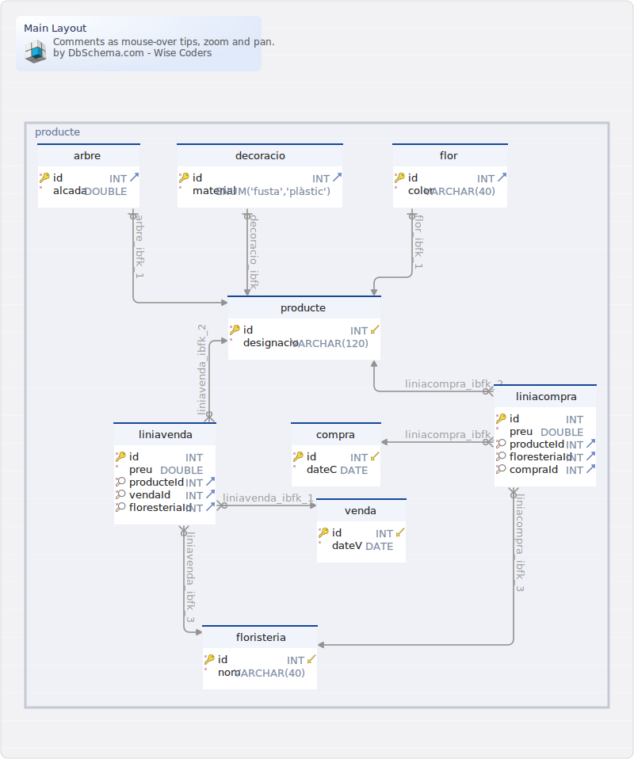

#Main Layout
Generated using [DbSchema](https://dbschema.com)

### Main Layout

### Table floristeríadb.arbre 
| | | |
|---|---|---|
| * &#128273;  &#11016; | id| INT UNSIGNED  |
| * | alcada| DOUBLE  |

##### Indexes 
| | | |
|---|---|---|
| &#128273;  | pk\_arbre | ON id|

##### Foreign Keys
| | | |
|---|---|---|
|  | arbre_ibfk_1 | ( id ) ref [floristeríadb.producte](#producte) (id) |

##### Options 
ENGINE=InnoDB DEFAULT CHARSET=utf8mb4 COLLATE=utf8mb4\_general\_ci 

### Table floristeríadb.compra 
| | | |
|---|---|---|
| * &#128273;  &#11019; | id| INT UNSIGNED AUTO_INCREMENT |
| * | dateC| DATE  |

##### Indexes 
| | | |
|---|---|---|
| &#128273;  | pk\_compra | ON id|
| &#128270;  | ind | ON id|

##### Options 
ENGINE=InnoDB DEFAULT CHARSET=utf8mb4 COLLATE=utf8mb4\_general\_ci 

### Table floristeríadb.decoracio 
| | | |
|---|---|---|
| * &#128273;  &#11016; | id| INT UNSIGNED  |
| * | material| ENUM('fusta','plàstic')  |

##### Indexes 
| | | |
|---|---|---|
| &#128273;  | pk\_decoracio | ON id|

##### Foreign Keys
| | | |
|---|---|---|
|  | decoracio_ibfk_1 | ( id ) ref [floristeríadb.producte](#producte) (id) |

##### Options 
ENGINE=InnoDB DEFAULT CHARSET=utf8mb4 COLLATE=utf8mb4\_general\_ci 

### Table floristeríadb.flor 
| | | |
|---|---|---|
| * &#128273;  &#11016; | id| INT UNSIGNED  |
| * | color| VARCHAR(40)  |

##### Indexes 
| | | |
|---|---|---|
| &#128273;  | pk\_flor | ON id|

##### Foreign Keys
| | | |
|---|---|---|
|  | flor_ibfk_1 | ( id ) ref [floristeríadb.producte](#producte) (id) |

##### Options 
ENGINE=InnoDB DEFAULT CHARSET=utf8mb4 COLLATE=utf8mb4\_general\_ci 

### Table floristeríadb.floristeria 
| | | |
|---|---|---|
| * &#128273;  &#11019; | id| INT UNSIGNED AUTO_INCREMENT |
| * | nom| VARCHAR(40)  |

##### Indexes 
| | | |
|---|---|---|
| &#128273;  | pk\_floristeria | ON id|
| &#128270;  | ind | ON id|

##### Options 
ENGINE=InnoDB DEFAULT CHARSET=utf8mb4 COLLATE=utf8mb4\_general\_ci 

### Table floristeríadb.liniacompra 
| | | |
|---|---|---|
| * &#128273;  | id| INT UNSIGNED AUTO_INCREMENT |
| * | preu| DOUBLE  |
| * &#128270; &#11016; | producteId| INT UNSIGNED  |
| * &#128270; &#11016; | floresteriaId| INT UNSIGNED  |
| * &#128270; &#11016; | compraId| INT UNSIGNED  |

##### Indexes 
| | | |
|---|---|---|
| &#128273;  | pk\_liniacompra | ON id|
| &#128270;  | compraId | ON compraId|
| &#128270;  | producteId | ON producteId|
| &#128270;  | floresteriaId | ON floresteriaId|

##### Foreign Keys
| | | |
|---|---|---|
|  | liniacompra_ibfk_1 | ( compraId ) ref [floristeríadb.compra](#compra) (id) |
|  | liniacompra_ibfk_2 | ( producteId ) ref [floristeríadb.producte](#producte) (id) |
|  | liniacompra_ibfk_3 | ( floresteriaId ) ref [floristeríadb.floristeria](#floristeria) (id) |

##### Options 
ENGINE=InnoDB DEFAULT CHARSET=utf8mb4 COLLATE=utf8mb4\_general\_ci 

### Table floristeríadb.liniavenda 
| | | |
|---|---|---|
| * &#128273;  | id| INT UNSIGNED AUTO_INCREMENT |
| * | preu| DOUBLE  |
| * &#128270; &#11016; | producteId| INT UNSIGNED  |
| * &#128270; &#11016; | vendaId| INT UNSIGNED  |
| * &#128270; &#11016; | floresteriaId| INT UNSIGNED  |

##### Indexes 
| | | |
|---|---|---|
| &#128273;  | pk\_liniavenda | ON id|
| &#128270;  | vendaId | ON vendaId|
| &#128270;  | producteId | ON producteId|
| &#128270;  | floresteriaId | ON floresteriaId|

##### Foreign Keys
| | | |
|---|---|---|
|  | liniavenda_ibfk_1 | ( vendaId ) ref [floristeríadb.venda](#venda) (id) |
|  | liniavenda_ibfk_2 | ( producteId ) ref [floristeríadb.producte](#producte) (id) |
|  | liniavenda_ibfk_3 | ( floresteriaId ) ref [floristeríadb.floristeria](#floristeria) (id) |

##### Options 
ENGINE=InnoDB DEFAULT CHARSET=utf8mb4 COLLATE=utf8mb4\_general\_ci 

### Table floristeríadb.producte 
| | | |
|---|---|---|
| * &#128273;  &#11019; | id| INT UNSIGNED AUTO_INCREMENT |
| * | designacio| VARCHAR(120)  |

##### Indexes 
| | | |
|---|---|---|
| &#128273;  | pk\_producte | ON id|
| &#128270;  | ind | ON id|

##### Options 
ENGINE=InnoDB DEFAULT CHARSET=utf8mb4 COLLATE=utf8mb4\_general\_ci 

### Table floristeríadb.venda 
| | | |
|---|---|---|
| * &#128273;  &#11019; | id| INT UNSIGNED AUTO_INCREMENT |
| * | dateV| DATE  |

##### Indexes 
| | | |
|---|---|---|
| &#128273;  | pk\_venda | ON id|
| &#128270;  | ind | ON id|

##### Options 
ENGINE=InnoDB DEFAULT CHARSET=utf8mb4 COLLATE=utf8mb4\_general\_ci 

